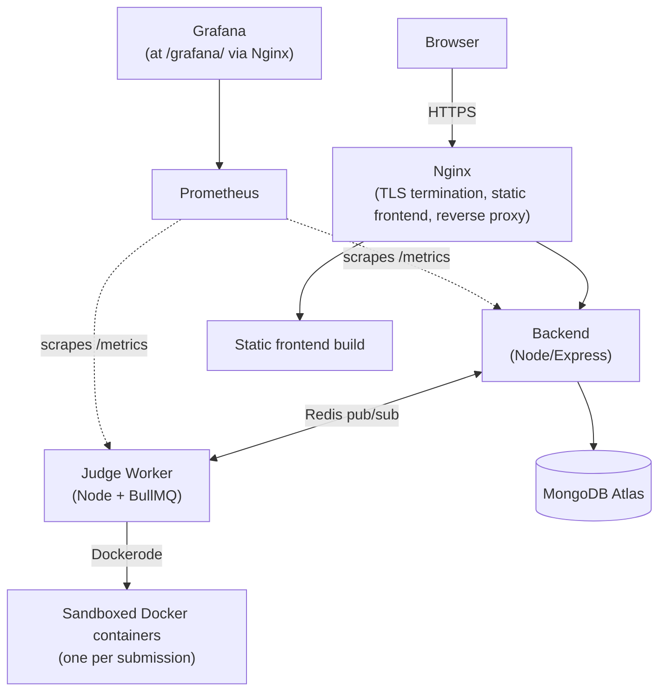

# Online Judge

A full-stack competitive programming judge — write code, submit it, get a real verdict from a sandboxed execution environment, and climb a live leaderboard. Built as a portfolio project to work through the same categories of problems (async job queues, containerized execution, IaC, monitoring, CI/CD) that come up in real junior/new-grad backend and platform work.

**Live demo:** https://16-112-249-157.sslip.io
*(hosted on a small AWS instance — may be asleep/stopped between visits to control cost; give it a moment on first load)*

---

## What it does

- Submit code in Python, C++, Java, or JavaScript against a set of problems
- Get a real verdict — Accepted, Wrong Answer, TLE, MLE, Runtime Error, Compile Error — computed by actually running your code in an isolated Docker container, not a mock
- Watch verdicts and leaderboard updates arrive live via WebSockets, no polling
- Get an AI-generated hint on a failed submission (Gemini API)
- (Admin) Generate new problems with AI assistance, review a plagiarism-similarity report across submissions, and view usage analytics
- Track your standing in real time on a per-problem leaderboard

---

## Screenshots

---

## Architecture



**Why a separate judge worker process, not just a backend route?** Running untrusted user code needs to happen somewhere isolated from the main API process — if a submission hangs or misbehaves, it shouldn't be able to take down request handling for everyone else. The backend enqueues a job in Redis via BullMQ; the judge worker picks it up, spins up a locked-down Docker container (no network, capped memory/CPU/time), runs the code, and reports the verdict back over Redis pub/sub, which the backend relays to the browser over Socket.io.

**Why pm2 instead of Docker for the judge worker?** It needs direct access to the host's Docker daemon to spin up sandboxed containers for each submission — containerizing the thing that manages containers adds real complexity (Docker-in-Docker or socket-mounting) for limited benefit at this scale, so it runs as a managed host process instead.

---

## Tech stack

| Layer | Technology |
|---|---|
| Backend API | Node.js, Express, MongoDB Atlas, Mongoose |
| Judge worker | Node.js, Redis, BullMQ, Dockerode |
| Sandboxed execution | Docker (network disabled, memory/CPU/time limits enforced per submission) |
| Frontend | React, Vite, Redux Toolkit, Monaco Editor |
| Real-time | Socket.io (verdicts, live leaderboard), Redis pub/sub bridge between judge-worker and backend |
| AI features | Google Gemini API (submission hints, admin problem generator) |
| Plagiarism detection | Custom MOSS-style winnowing fingerprint algorithm (k-gram rolling hash + sliding-window minimum) |
| Infrastructure | Terraform (AWS EC2, security groups, IAM), single parameterized config supporting multiple environments |
| Deployment | Docker Compose (backend, Redis, Prometheus, Grafana), pm2 (judge worker), Nginx (reverse proxy + static frontend), Let's Encrypt via certbot |
| Monitoring | Prometheus + Grafana, custom dashboard (HTTP request rate, p95 latency, judge execution p95 latency, queue depth, submissions by verdict) |
| CI/CD | GitHub Actions — lint/build checks on every push and PR, automatic deploy to production on merge to `main` |

---

## Current usage

*(fill in from the /analytics dashboard once there's real traffic — pulling directly from there keeps this section honest and up to date)*

- Total submissions since launch: `[X]`
- Acceptance rate: `[X]%`
- Registered users: `[X]`
- Active users (last 30 days): `[X]`
- Most-used language: `[X]`

---

## Running it locally

**Prerequisites:** Node 20+, Docker Desktop, a MongoDB Atlas connection string (or local MongoDB), Redis.

```bash
git clone https://github.com/thunderbolt3-14/online-judge.git
cd online-judge
```

Fill in the three env files — see `infra/ENV_TEMPLATE.md` for the exact content and every field's purpose:
- `backend/.env`
- `judge-worker/.env`
- `frontend/.env.production` (or use Vite's dev defaults for local work)

Start the backend, Redis, and monitoring stack:
```bash
docker compose up -d --build
```

Start the judge worker (needs direct Docker access, so it runs outside Compose):
```bash
cd judge-worker
npm ci
npm run dev
```

Start the frontend:
```bash
cd frontend
npm ci
npm run dev
```

Pull the sandbox language images once, ahead of time (also handled automatically by `infra/scripts/server-setup.sh` on a real deploy):
```bash
docker pull python:3.11-alpine
docker pull gcc:13-bookworm
docker pull node:20-alpine
docker pull eclipse-temurin:21-jdk-alpine
```

---

## Deploying

Full deployment is automated via Terraform (infrastructure) + GitHub Actions (CI/CD). See `infra/ENV_TEMPLATE.md` for the complete redeploy sequence, including the Nginx config block and the exact commands to run after a fresh `terraform apply`.

- `terraform apply` provisions or updates the EC2 instance, security group, IAM role, and Elastic IP — parameterized by an `environment` variable so the same config can stand up a staging environment alongside production without resource-naming collisions.
- Every push to `main` triggers `.github/workflows/ci.yml` (lint + build across all three services) and, on success, `.github/workflows/deploy-production.yml` (SSH deploy: pull latest code, rebuild containers, restart the judge worker, rebuild the frontend).

---

## Challenges and how they were solved

**Judge submissions hanging indefinitely (Phase 10).** Submissions were timing out regardless of the configured time limit. Root cause: stdin was being streamed into the sandboxed container via `container.attach()` + `stream.end()`, which doesn't reliably deliver EOF to the container — especially under Docker Desktop on Windows. Fixed by writing input to a file on disk and using shell redirection (`sh -c "cmd < input.txt"`) instead of the attach-stream approach.

**Grafana returning "Client sent an HTTP request to an HTTPS server" (Phase 11c).** Nginx terminates TLS and proxies to Grafana over plain HTTP internally, but `GF_SERVER_PROTOCOL` had been set to `https`, so Grafana's own listener expected a TLS handshake it never received. Fixed by keeping `GF_SERVER_PROTOCOL=http` (Grafana never terminates TLS itself) and expressing the public-facing HTTPS URL via `GF_SERVER_ROOT_URL` instead, plus `GF_SERVER_SERVE_FROM_SUB_PATH=true` for the `/grafana/` subpath to resolve assets correctly.

**Renaming Terraform resources without destroying production.** Parameterizing the Terraform config for multiple environments meant resource names would change (`online-judge-sg` → `online-judge-production-sg`), and AWS treats a `name` change on security groups, IAM roles, and key pairs as force-replacement — which would have destroyed the live instance. Solved by making `production` the implicit, unsuffixed environment (so its resource names stay byte-identical to what's already deployed) and giving only non-default environments an explicit suffix — verified safe with `terraform plan` (`0 to destroy`) before every apply.

**CI/CD SSH access to a security-group-restricted server.** The EC2 security groups only allowed SSH from a single admin IP. GitHub Actions runners use dynamic, non-allowlistable IPs, so automated deploys were blocked outright. Resolved by adding a second, explicit SSH ingress rule open to `0.0.0.0/0` labeled for CI/CD use, relying on key-based authentication (password auth is disabled) as the actual security boundary rather than IP restriction for that path.

**React `set-state-in-effect` lint errors.** Two components (`Leaderboard`, `Analytics`) initially called `setState` synchronously inside a `useEffect` body to set an initial default value, which triggers an avoidable extra render. Fixed by deriving the default value directly during render (or via the initial `useState` value) instead of via an effect, reserving the effect only for genuinely external synchronization (API calls, socket subscriptions).

---

## Known limitations

Deliberate scope decisions for a portfolio project, not oversights — flagged here for anyone (including interviewers) evaluating this honestly:

- **No horizontal judge-worker scaling.** One worker process handles the job queue; under real concurrent load, submissions would queue rather than parallelize.
- **No load-tested capacity numbers.** Performance characteristics (max sustained submissions/sec, p99 latency under load) haven't been formally measured.
- **No multi-region or high-availability setup.** Single EC2 instance, single region (ap-south-2). A region outage or instance failure means downtime.
- **No chaos engineering / fault injection testing.**
- **No AST-level plagiarism detection.** The winnowing algorithm catches token-level similarity, not semantically-equivalent-but-differently-structured code.
- **No Kubernetes/EKS.** Deliberately excluded — the operational complexity and cost overhead aren't justified at this project's actual scale; Docker Compose + a single instance is the right-sized solution here.
- **No permanent staging environment.** A staging environment (parameterized via the same Terraform config) was built and exercised end-to-end with a real PR-triggered deploy pipeline, then intentionally torn down once the mechanics were proven — kept as CI (lint/build on every push and PR) plus direct production deploy on merge, rather than paying for an idle environment long-term.

---

## Roadmap

- [x] Core judging (Python, C++, Java, JavaScript) with sandboxed Docker execution
- [x] JWT auth, RBAC, Problems/Submissions CRUD
- [x] Real-time verdicts and leaderboard via Socket.io
- [x] AI-assisted hints and admin problem generation
- [x] Plagiarism detection (winnowing algorithm)
- [x] Infrastructure as code (Terraform), live deployment, HTTPS
- [x] Monitoring (Prometheus + Grafana)
- [x] CI/CD (GitHub Actions — lint/build + automated production deploy)
- [x] Usage analytics dashboard
- [] Real usage / user feedback
- [] Captured performance numbers under genuine load

---

## License

MIT — see [LICENSE](LICENSE).
